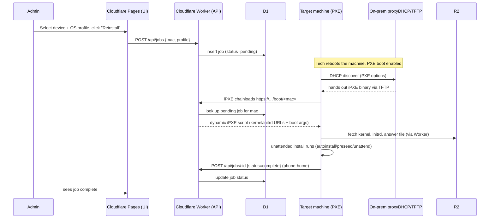

# Architecture

## Why hybrid, not pure-cloud

Cloudflare and GitHub can host every part of this system that speaks HTTPS: the
admin UI, the deployment API, OS images, and unattended-install answer files.
What they *cannot* do is answer a DHCP/PXE broadcast — that's link-local
traffic that never leaves the target machine's LAN segment. So a small piece
has to live on-prem: a **proxyDHCP** service (e.g. `dnsmasq`) that tells a
netbooting machine where to fetch its boot loader (iPXE), which then chains to
Cloudflare over HTTPS for everything else.

Everything past that first PXE handshake is cloud-hosted.

## Components

| Layer | Where | What |
|---|---|---|
| Admin UI | Cloudflare Pages | Register devices, pick an OS profile, kick off a reinstall, watch job status |
| API + boot script generator | Cloudflare Workers | REST API for devices/jobs, and `/boot/:mac` which returns a per-machine iPXE script |
| State | Cloudflare D1 | Device inventory, deployment jobs, status/history |
| Images & answer files | Cloudflare R2 | Kernels, initrds, ISOs, autoinstall/preseed/unattend files, streamed to iPXE over HTTPS |
| CI/CD | GitHub Actions | Deploy the Worker (`wrangler deploy`) and Pages site on push to main |
| Network boot | On-prem | `dnsmasq` proxyDHCP + iPXE chainloading to the Worker |

## Flow



## Repo layout

```
worker/     Cloudflare Worker: REST API + /boot/:mac iPXE generator (Hono + D1 + R2)
frontend/   Cloudflare Pages: minimal admin UI (devices, jobs, deploy)
boot/       iPXE snippets, proxyDHCP config, per-OS unattended-install profiles
.github/    CI + deploy workflows
```

## Security notes (read before pointing this at real hardware)

- Put the admin UI and API behind Cloudflare Access (Zero Trust) — this
  scaffold ships with no auth on `/api/*`.
- `/boot/:mac` is intentionally unauthenticated (a netbooting machine has no
  credentials yet) — treat MAC-based job lookup as the trust boundary, and
  make jobs single-use / short-lived so a leaked boot URL can't be replayed.
- Windows ISOs are not redistributable — this scaffold only stores an
  `autounattend.xml` template; you supply your own licensed Windows media in
  R2. Ubuntu/Debian netboot images are fine to mirror into R2 directly.
- Keep PXE/proxyDHCP on a segmented VLAN — a rogue proxyDHCP on a flat
  network can hijack any machine's boot process, including yours.
